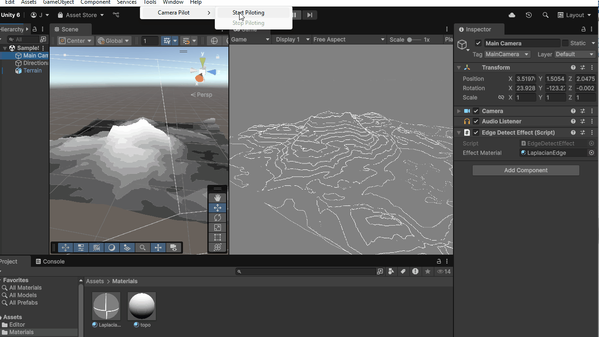

# Topographical Map Shader

... in Unity. Following the tutorial by Alan Zucconi [here](https://www.alanzucconi.com/2022/04/19/topographical-maps/), with a few minor tweaks for personal taste.

## Preview

A bit noisy. I should probably do some anti-aliasing.

## Tweaks

- Used a continous (sort of) ramp texture and calculated the banding in shader.
- Added a band number slider, which is an int slider using custom ShaderGUI.  
    *(This is not at all necessary for the shader to work. XD)*
- Allowing customization of colors in the 2nd phase render result.